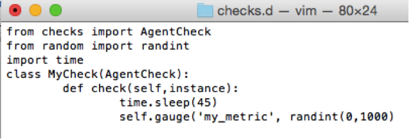
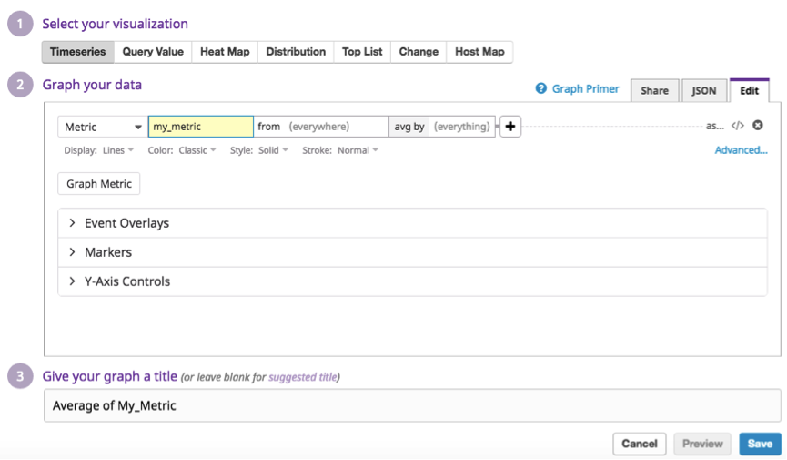
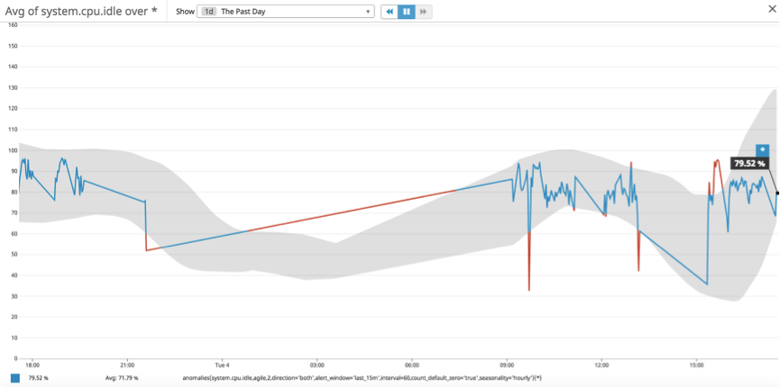
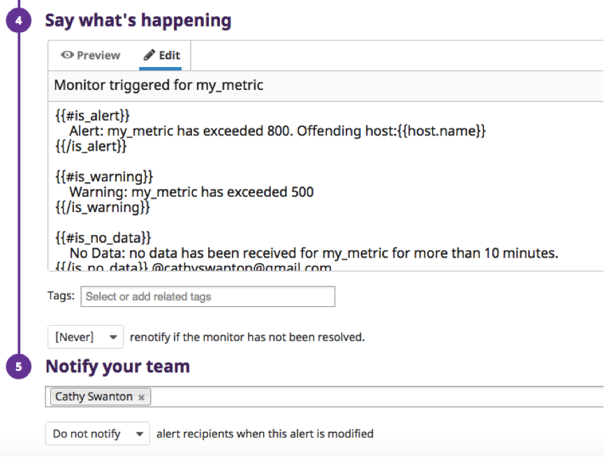
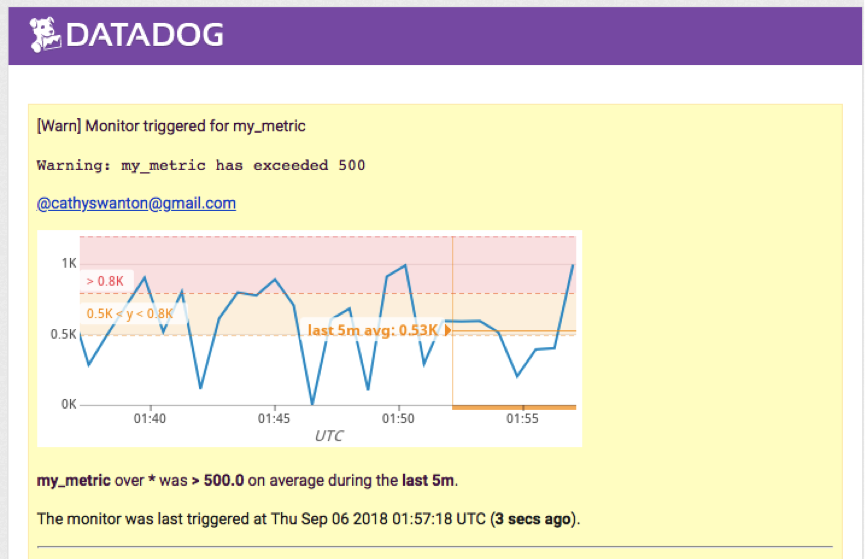
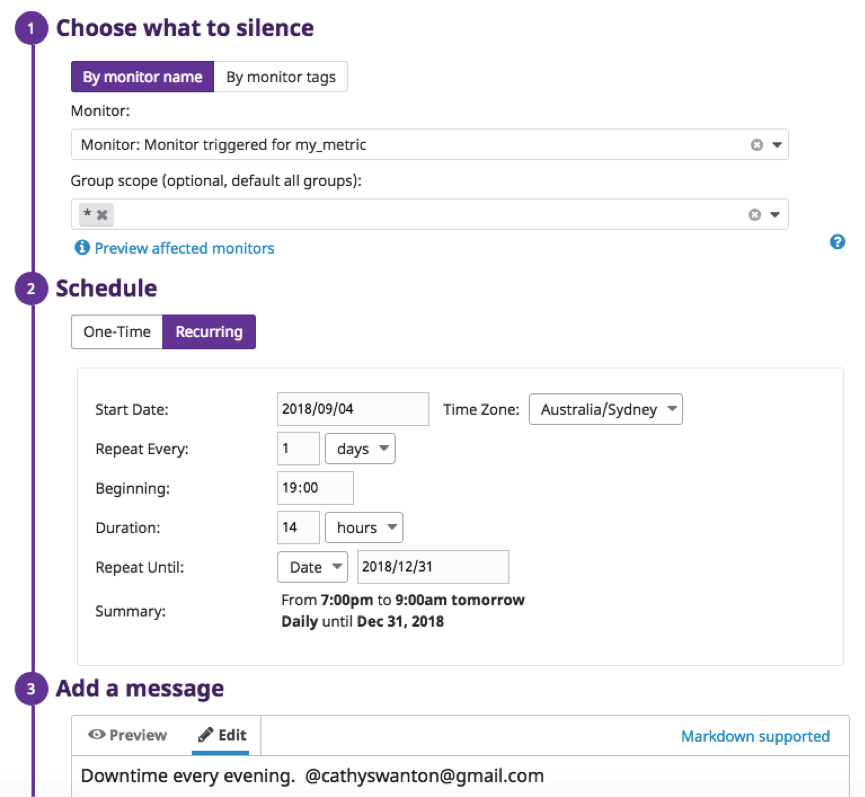
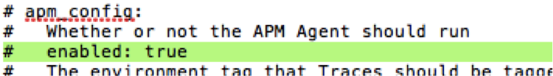
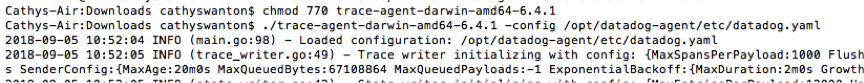

Your answers to the questions go here.

Note: PDF version also uploaded.  

Datadog Recruitment Candidate Exercise
Cathy Swanton
05/09/2018

1. Collecting Metrics

1.1. Adding Tags
To add tags using the Agent config file, I followed the instructions in the following documentation: https://docs.datadoghq.com/tagging/assigning_tags/

I edited the config file ‘/opt/datadog-agent/etc/datadog.yaml’ to include some sample tags, as shown in the image below. 

Figure 1 1. Adding tags in the Agent config file.

I then restarted the Agent using the following commands:
>> launchctl stop com.datadoghq.agent
>> launchctl start com.datadoghq.agent

To confirm that these tags had been successfully added, I went to the Host Map in the UI. See image below.   

Figure 1 2. Tags visible in Host Map.

1.2. Installing Datadog Integration
To install a Datadog Integration, I first downloaded MySQL and then searched for MySQL in  Datadog. 

Figure 1 3. Searching for MySQL in Datadog.

I clicked on the link and installed it. The image below shows that it has been successfully installed. 

Figure 1 4. MySQL integration installed.

1.3. Creating a Custom Agent Check

To create a custom agent check, I followed the ‘Hello World’ example described on the website (https://docs.datadoghq.com/developers/agent_checks/). This example created a hello.world metric with a value of 1. After seeing how this was done, I created the ‘my_metric’ metric as follows:

•	Create a file /opt/datadog-agent/etc/conf.d/mycheck.d/mycheck.yaml 
This is essentially a dummy config file, with no real content. 

Figure 1 5. Yaml config file.
•	Create a file /opt/datadog-agent/etc/checks.d/mycheck.py
This python file will create a random variable between 0 and 1000 and add it to the metric ‘my_metric’ 

Figure 1 6. Python file.
•	Restart the agent
>> launchctl stop com.datadoghq.agent
>> launchctl start com.datadoghq.agent

1.4. Changing the Collection Interval

1.4.1. Using the Python check file
To add a 45 second collection interval, you can add a delay in the Python code using the time module. See code implemented below. 

Figure 1 7. Changing the collection interval using Python code.

1.4.2. Using the .yaml config file (Bonus Question)
A nicer way of changing the collection interval is to use the .yaml config file. Add a 45 second collection interval as follows:

Figure 1 8. Changing the collection interval using the config file.

To validate that this was successfully working, I plotted ‘my_metric’ and could see that the points were being added to the graph in 45 second intervals. The first image below shows a data point at 11:21:59 and the next is 45 seconds later at 11:22:44. 

 Figure 1 9. 45 second collection interval.

2. Visualizing Data

I created a new Timeboard called MyMetric. 

2.1. Custom Metric Timeseries
In the new dashboard, I added a timeseries graph for the average of my custom metric, ‘my_metric’. Since I only have one host, there was no need to specify which host. 

Figure 2 1. Creating a timeseries for 'my_metric'.

2.2. Using the Anomaly Function
To create an Anomaly, I used the variable ‘system.cpu.idle’. The JSON code for the graph is given below. It is plotting an anomaly for system.cpu.idle using the agile method with a bounds value of 2. 

{
  "viz": "timeseries",
  "status": "done",
  "requests": [
    {
      "q": "anomalies(avg:system.cpu.idle{*}, 'agile', 2, direction='both', alert_window='last_15m', interval=60, count_default_zero='true', seasonality='hourly')",
      "type": "line",
      "style": {
        "palette": "dog_classic",
        "type": "solid",
        "width": "normal"
      },
      "conditional_formats": [],
      "aggregator": "avg"
    }
  ],
  "autoscale": true
}

2.3. Using the Rollup Function
I added a new timeseries graph to the dashboard for my custom metric. I then changed the JSON code to use the rollup function. The time is in seconds, so to sum all the points in the last hour will require a value of 3600. 

{
  "viz": "timeseries",
  "status": "done",
  "requests": [
    {
      "q": "avg:my_metric{*}.rollup(sum, 3600)",
      "type": "line",
      "style": {
        "palette": "dog_classic",
        "type": "solid",
        "width": "normal"
      },
      "conditional_formats": [],
      "aggregator": "avg"
    }
  ],
  "autoscale": true
}

The resulting dashboard looks like this:

Figure 2 2. Dashboard over 4 hour timeframe.

2.4. Setting the Timeframe to 5 Minutes. 
To change the timeframe to 5 minutes, I used the mouse to zoom in on the graph. 

Figure 2 3. Dashboard with 5minute timeframe.

2.5. Take a Snapshot of the Graph. 
To take a snapshot of the graph I clicked on the camera icon and used the @ notation to send it to myself. Below is a sample of the email that will be received. 

Figure 2 4. Email received from snapshot.

2.6. What is the Anomaly graph displaying? 

The anomaly graph displays any abnormalities in the metric cpu.idle. Unfortunately, since I only have 1 day of data available, the anomalies are pretty meaningless. Ideally, I would have a couple of weeks worth of data and I would expect to see more normal patterns and therefore the algorithm would better detect anomalies. 

However, working with the limited data available, below is a plot of the cpu.idle metric over the last day. The grey region shows the bounds, or the range of values that the algorithm would regard as ‘normal’. Whenever the actual value is greater or less than these bounds, the trace is red. 

Figure 2 5. Anomaly Graph.

3. Monitoring Data. 

3.1. Creating a Metric Monitor

The screenshots below capture the process of creating a metric monitor and configuring the alert messages. The alert conditions send an alert message when the value exceeds 800 and a warning message when it exceeds 500 (red and yellow boxes, respectively, in step 3 in the image below). I have also enabled the option to notify if the data is missing for more than 10 minutes. 

Figure 3 1. Alert conidtions for metric monitor.

The figure below shows how to configure the monitor alerts. Different messages are sent for the three scenarios – alert, warning and no_data.   

Figure 3 2. Configuring the notifications.

The figure below shows the email message received when the value exceeds 800. Unfortunately, the host.name variable is not being populated. Not too sure why…  

Figure 3 3. Sample Alert message.

And a sample email for the warning scenario (value between 500 and 800): 

Figure 3 4. Sample Warning notification.

And finally, to validate the no_data case, I stopped the Agent for 10 minutes and got the following email. 

Figure 3 5. No_Data notification.

3.2. Scheduling Downtime

To schedule a downtime, I used the UI and went to Monitors->Manage Downtime. I scheduled two new downtimes. The first, shown below, silences the monitor for my_metric at 7PM for 14 hours (until 9AM) every day of the week. The image below shows the settings used. 

Figure 3 6. Downtime every evening from 7PM to 9AM.

The second downtime I scheduled to start at one minute past midnight on Saturday morning and last for two days, to cover the entire weekend. This downtime will overlap with the evening one set previously, so the monitor will be ignored from 7PM on Friday evening until 9AM on Monday morning. These settings are shown in the image below. 

Figure 3 7. Downtime scheduled for weekends.
The images below show the email messages received after scheduling the downtimes. Note that the time zone is UTC, so at first the times look off! 

Figure 3 8. Email notification received for evening downtime.

Figure 3 9. Email notification received for weekend downtime.

4. Collecting APM Data

I faced a few issues here. I saved the sample Flask application as my_app.py and installed ddtrace as instructed. However, when I ran the following command:
>> ddtrace-run python my_app.py

I got the following error messages: 

Figure 4 1. Error message - connection refused.

I tried multiple fixes, including killing the port:8126, running without the datadog trace, and editing the datadog.yaml configuration file to uncomment the line highlighted below. 

Figure 4 2. An attempted fix - changing the yaml config file.

None of these fixes worked however. I then stumbled upon these setup instructions: https://docs.datadoghq.com/tracing/setup/ and found that for MacOS, the TraceAgent is not pre-packaged with the standard Agent, as it is for Windows and Linux. So I then downloaded and ran the trace agent. 

(Learning from this: read the instructions first before diving straight in and you will save yourself considerable time!!)

Figure 4 3. Installing trace agent.

After properly reading the instructions, I again ran the ddtrace command with my app. No more error messages this time. I sent some requests to the app, using the following curl commands:

Figure 4 4. Sending requests to the app.

Looking at the Datadog UI, I could now see some data (finally ☺). 

Figure 4 5. APM dashboard.

I then exported the latency graph to a new Dashboard:

Figure 4 6. Latency graph exported to timeboard.

This is a link to the APM: 
https://app.datadoghq.com/apm/services?start=1536105716744&end=1536109316744&paused=false&env=none&watchdogOnly=false

Difference between a Service and a Resource

A service is a set of processes that work together to provide a feature set. For examble, a web application might consist of two services – a webapp service and a database service. These two services provide different functions for the same feature (web application). 

A resource is a particular query to a service. Using the web application example again, a resource might be a canonical URL like /user/home. 

 Final Question

I would use Datadog to monitor how busy my gym is. A pet peeve of mine is going to the gym and finding it packed. Having to queue up to use a machine irritates me and it means it takes me longer to do my routine. To prevent this annoyance, I would use Datadog to monitor how many people are coming and going, so before I leave home I can decide whether or not it is worth my while. 

I would setup a monitor to alert me when the metric is below a certain threshold, notifying me that it is a good time to go. I would schedule this monitor to only alert me during times when I would be interested in going – so say I would set a downtime while I am at work, and only get alerts in the evening. 

